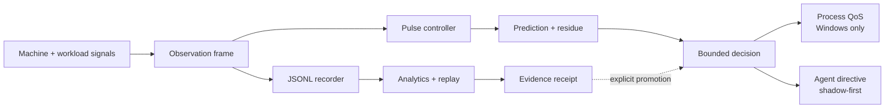

<div align="center">
  

  # PulseFlow Governor

  **See the pressure. Study the flow. Govern only what the evidence supports.**

  A local-first Rust control system for observing CPU, GPU, RAM, thermals, and
  workload behavior—then testing bounded process and agent policies against
  recorded evidence.

  [](https://github.com/jacksonjp0311-gif/PulseFlow/actions/workflows/ci.yml)
  [](Cargo.toml)
  [](#safety-is-the-feature)
  [](LICENSE)
  [](Cargo.toml)
</div>

<p align="center">
  
</p>

## Why PulseFlow exists

Computational workloads rarely fail because one metric is high. They become
unstable when several pressures interact: CPU bursts, memory saturation, GPU
heat, queue growth, process contention, and delayed outcomes.

PulseFlow turns those signals into one inspectable feedback loop:

- **Observe** the machine and a selected process without requiring control.
- **Record** time-aligned JSONL frames with controller decisions and outcomes.
- **Explain** raw stress, filtered stress, prediction residue, modulation, and
  every authority transition.
- **Replay** a saved workload against candidate tuning before touching a live
  process.
- **Compare** baseline and governed sessions using explicit evidence gates.
- **Govern** only inside a bounded, process-scoped Windows QoS envelope.
- **Advise agents** with shadow-first concurrency, batching, routing, token, and
  retrieval recommendations.

> PulseFlow is an instrumentation and experimental-governance system. It does
> not promise that every workload will become faster, cooler, or cheaper.

## The idea in one picture



The feedback loop is deliberately asymmetric: observation is always available;
control requires identity, verification, authority, and evidence.

## What you get

| Surface | Human meaning |
|---|---|
| Live telemetry | CPU, RAM, supported NVIDIA GPU utilization, temperature, power, VRAM, process pressure, and optional agent I/O |
| Pulse controller | Weighted stress, filtering, PID-style feedback, residue memory, bounded forecast, slew limits, and QoS hysteresis |
| System interlink | Discover → connect → verify → enable authority with receipt-linked transitions |
| Observation lab | Persistent JSONL sessions, metadata, export, historical charts, and aligned next-interval outcomes |
| Analytics | Stability, prediction RMSE, thermal oscillation, energy, bursts, queue pressure, and full-session summaries |
| Replay | Run candidate controller settings over saved observations without changing the live machine |
| Futurist governor | Bounded pressure forecasts and confidence—not autonomous authority escalation |
| Memory guard | Contracts background, token, retrieval, concurrency, and batch pressure above 85% RAM; serializes agent work above 95% |
| Install experience | Branded executable, Start Menu entry, desktop shortcut, resilient launcher, favicon, and web-app manifest |

## Start in two minutes

### Requirements

- Windows 10 or 11 for active process QoS
- [Rust 1.75 or newer](https://www.rust-lang.org/tools/install)
- Optional: `nvidia-smi` for NVIDIA GPU telemetry

### Install with the desktop icon

```powershell
git clone https://github.com/jacksonjp0311-gif/PulseFlow.git
cd PulseFlow
powershell -ExecutionPolicy Bypass -File .\scripts\Install-PulseFlow.ps1 -DesktopShortcut
```

Open **PulseFlow Governor** from the desktop or Start Menu. The launcher reuses
an existing healthy instance or starts a new one, waits for the health endpoint,
and opens the dashboard automatically.

The default per-user installation is:

```text
%LOCALAPPDATA%\Programs\PulseFlow Governor
```

### Run directly from source

```powershell
cargo run --release -- serve
```

Then open [http://127.0.0.1:8791](http://127.0.0.1:8791).

Monitor-only mode starts with no process authority. To launch around a workload:

```powershell
cargo run --release -- run -- "C:\Path\To\program.exe" --your-arguments
```

Or attach at startup to an existing PID:

```powershell
cargo run --release -- attach 1234
```

The dashboard can also discover, connect, verify, enable, and disconnect
processes while the server remains running.

## A safe experimental workflow

1. **Observe first.** Let a monitor-only baseline record for several minutes.
2. **Choose one workload.** Keep the program, task, data, and ambient conditions
   as stable as practical.
3. **Create a fresh session.** Do not mix baseline and governed intervals.
4. **Connect and verify.** Confirm the executable identity before granting
   process-scoped authority.
5. **Enable bounded governance.** PulseFlow applies only supported QoS changes.
6. **Repeat the same workload.**
7. **Compare sessions.** Treat results as descriptive until the sample boundary
   and experimental controls are satisfied.
8. **Replay before retuning.** Candidate gains belong in replay or shadow first.
9. **Delete raw recordings after analysis** when the aggregate evidence you need
   has been preserved.

Saved data is local:

```text
state/sessions/<session-id>.jsonl
state/sessions/<session-id>.meta.json
```

PulseFlow does not upload recordings to a cloud service. Runtime state is
excluded from Git.

## Safety is the feature

PulseFlow is intentionally narrower than hardware-tuning software.

### It can

- Observe the whole machine.
- Read supported NVIDIA telemetry through `nvidia-smi`.
- Record and replay local observation frames.
- Apply bounded Windows process QoS to a verified PID.
- Publish shadow-first agent workload recommendations.
- Pause, disconnect, or fall back to monitor-only operation.

### It will not

- Change CPU or GPU clocks.
- Write voltages.
- Control fan curves.
- Modify BIOS, firmware, or power limits.
- Bind an agent merely because a process was discovered.
- Skip discover, connect, verify, and enable gates.
- Promote adaptive tuning from a single uncontrolled recording.

On unsupported platforms, telemetry, recording, analytics, replay, and agent
directives remain available; active process QoS stays monitor-only.

## Authority that humans can audit

```text
Disconnected
    ↓ discover
Discovered
    ↓ connect + capture identity
Connected
    ↓ verify PID, executable, and platform support
Verified
    ↓ explicit enable
Active
    ↓ pause / fault / disconnect
Paused or Disconnected
```

Transitions emit evidence receipts containing the target identity hash,
configuration hash, checks performed, action result, and previous-receipt hash.
The UI's verification seal is derived from live backend facts—not a decorative
animation.

## Learning stages

PulseFlow separates learning from authority:

| Stage | Purpose | May alter a live target? |
|---|---|---:|
| Recorder | Capture aligned evidence | No |
| Analytics | Summarize behavior | No |
| Replay | Test candidate tuning offline | No |
| Shadow | Publish hypothetical decisions | No |
| Bounded adaptive | Propose small, gated tuning steps | Only when explicitly allowed |
| Agent policy | Publish live agent recommendations | Only after evidence and integration gates |

Agent directives remain `shadow_only: true` until the configured minimum sample
boundary is met and the operator selects the appropriate learning stage.

## Dashboard

The local web console includes:

- Telemetry, modulation, dataset, agent, analytics, replay, logs, and
  configuration views
- Live raw-versus-filtered stress scopes
- Pressure forecast and confidence
- Process discovery and interlink verification
- Recording controls and session export
- Baseline/candidate comparison
- Controller replay with candidate tuning
- Authority receipts and runtime event ledger
- System heat map and observation-frame preview

<details>
<summary><strong>View the visual direction</strong></summary>

<br>


The production dashboard follows this instrumentation-first design language
while keeping every displayed claim tied to backend state.

</details>

## HTTP integration

PulseFlow binds to loopback by default: `127.0.0.1:8791`.

| Method | Route | Purpose |
|---|---|---|
| `GET` | `/health` | Lightweight readiness check |
| `GET` | `/api/status` | Complete live runtime state |
| `GET` | `/api/sessions` | Saved session metadata |
| `GET` | `/api/session/{id}?limit=N` | Historical observation frames |
| `GET` | `/api/summary/{id}` | Full-session derived metrics |
| `GET` | `/api/interlink` | Truth-derived authority verification |
| `POST` | `/api/replay` | Offline candidate replay |
| `POST` | `/api/compare` | Baseline/candidate report |
| `POST` | `/api/recording` | Start or pause recording |
| `POST` | `/api/session/new` | Begin a clean recording session |

Machine-readable contracts live in `schemas/`.

## Configuration

The default configuration is `config/pulseflow.json`. Point to another file
without modifying the installation:

```powershell
$env:PULSEFLOW_CONFIG = "C:\Path\To\pulseflow.json"
cargo run --release -- serve
```

Important boundaries include:

- controller setpoints and gains
- telemetry weights
- sampling interval
- storage limits
- QoS dwell and thermal guards
- analytics evidence thresholds
- maximum agent concurrency and batch size
- adaptation sample and gain-step limits

## Verify the complete system

Run the same local verification lattice used before promotion:

```powershell
powershell -ExecutionPolicy Bypass -File .\scripts\ARIA-Verify.ps1
```

It validates:

- the content-addressed package manifest
- JSON and UI/API contracts
- PowerShell 5.1 semantics
- browser JavaScript parsing
- Rust formatting and compilation
- unit, analytics, authority, policy, replay, storage, and UI tests
- optimized release build
- live HTTP smoke behavior

The current promoted build passes **26 tests** plus the full live verification
gate.

## Repository map

```text
PulseFlow/
├── src/
│   ├── controller.rs    pulse feedback and bounded prediction
│   ├── telemetry.rs     machine, process, GPU, and agent signals
│   ├── governor.rs      process-scoped QoS implementation
│   ├── authority.rs     discover/connect/verify/enable state machine
│   ├── analytics.rs     rolling and full-session evidence
│   ├── replay.rs        offline controller simulation
│   ├── policy.rs        memory-aware agent recommendations
│   ├── storage.rs       JSONL recording and metadata
│   └── server.rs        local HTTP API and embedded web assets
├── web/                 local operator console
├── schemas/             machine-readable contracts
├── config/              default bounded configuration
├── scripts/             installer and ARIA verification
├── tests/               behavioral and contract coverage
├── docs/                architecture, control, data, and safety notes
└── assets/icons/        application and installable-web-app icons
```

## Documentation

- [Architecture](docs/ARCHITECTURE.md)
- [Control model](docs/CONTROL_MODEL.md)
- [Authority state model](docs/AUTHORITY_STATE_MODEL.md)
- [Data model](docs/DATA_MODEL.md)
- [Experimental methodology](docs/EXPERIMENTAL_METHODOLOGY.md)
- [Futurist governor](docs/FUTURIST_GOVERNOR.md)
- [Metric glossary](docs/METRIC_GLOSSARY.md)
- [Icon and installation](docs/ICON_AND_INSTALLATION.md)

## Contributing

PulseFlow welcomes focused changes that preserve its safety model.

1. Fork the repository and create a feature branch.
2. Keep authority expansion explicit and bounded.
3. Add tests for controller, policy, storage, API, or UI contract changes.
4. Run `cargo fmt --check`, `cargo test`, and `ARIA-Verify.ps1`.
5. Explain the evidence behind behavioral tuning.

Please do not present a replay result or one uncontrolled session as proof of a
causal performance improvement.

## License

[MIT](LICENSE) © 2026 James Paul Jackson.

---

<div align="center">
  <strong>PulseFlow makes computational pressure visible—and keeps authority accountable.</strong>
</div>
