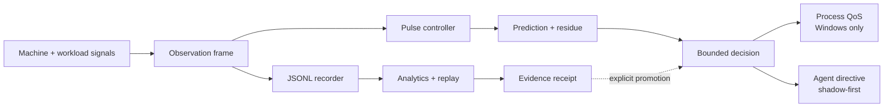
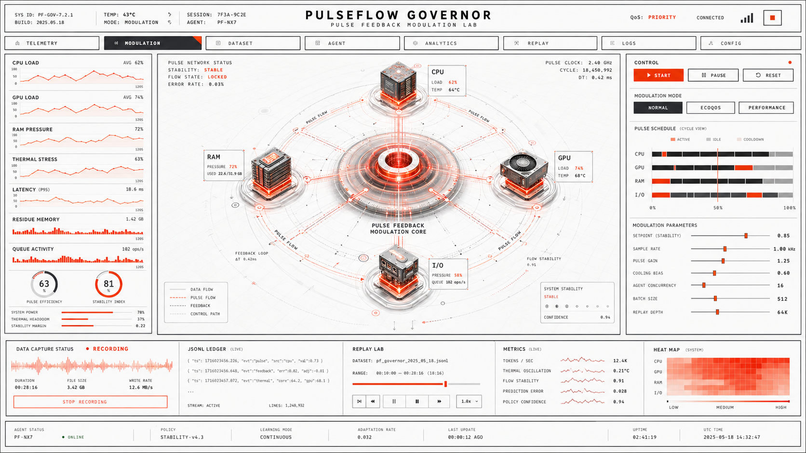

<div align="center">
  

  # PulseFlow Governor

  **See the pressure. Study the flow. Govern only what the evidence supports.**

  A local-first Rust control system for observing CPU, GPU, RAM, thermals, and
  workload behavior—then testing bounded process and agent policies against
  recorded evidence.

  [](https://github.com/jacksonjp0311-gif/PulseFlow/actions/workflows/ci.yml)
  [](Cargo.toml)
  [](#safety-is-the-feature)
  [](LICENSE)
  [](Cargo.toml)
</div>

<p align="center">
  
</p>

## Why PulseFlow exists

Computational workloads rarely fail because one metric is high. They become
unstable when several pressures interact: CPU bursts, memory saturation, GPU
heat, queue growth, process contention, and delayed outcomes.

PulseFlow turns those signals into one inspectable feedback loop:

- **Observe** the machine and a selected process without requiring control.
- **Record** time-aligned JSONL frames with controller decisions and outcomes.
- **Explain** raw stress, filtered stress, prediction residue, modulation, and
  every authority transition.
- **Replay** a saved workload against candidate tuning before touching a live
  process.
- **Compare** baseline and governed sessions using explicit evidence gates.
- **Govern** only inside a bounded, process-scoped Windows QoS envelope.
- **Advise agents** with shadow-first concurrency, batching, routing, token, and
  retrieval recommendations.

> PulseFlow is an instrumentation and experimental-governance system. It does
> not promise that every workload will become faster, cooler, or cheaper.

## Origin: landing-control theory, extracted for compute

PulseFlow's governing principle grew from James Paul Jackson's independent
control-theory extraction inspired by the Falcon 9 landing problem: observe a
changing system, intervene in bounded pulses, preserve dwell between events,
and judge stability across the full trajectory rather than demanding that
every instant contract.

That work is formalized in the canonical
[Pulse-Feedback Stability Theory (PFP v2.0)](https://gist.github.com/jacksonjp0311-gif/8bd6b5446d6308d773ba71b88be36185).
PulseFlow turns its most useful ideas into inspectable compute-governance
signals:

- bounded, event-triggered intervention rather than continuous unbounded force;
- aggregate contraction using a Lyapunov-style error-energy proxy;
- contraction confidence and marginal-interval fraction;
- trigger-density and minimum-inter-event measurements for chatter detection;
- explicit capacity, authority, and effort channels;
- experiment epochs that split automatically when mode, tuning, or learning
  stage changes;
- falsifiable baseline/candidate evidence instead of automatic performance
  claims.

This is an independent software and theory project. It contains no SpaceX
source code or proprietary flight data, and it is not affiliated with or
endorsed by SpaceX. Falcon 9 and SpaceX are referenced only to describe the
author's source of engineering inspiration.

## The idea in one picture



The feedback loop is deliberately asymmetric: observation is always available;
control requires identity, verification, authority, and evidence.

## The finding: the controlled object is the computational ecosystem

A normal-activity recording revealed a boundary that process monitors hide:
host RAM rose from roughly 86% to 91%, CPU produced several 95%+ bursts, and
only part of that motion belonged to the selected browser PID. Controller
effort remained low while estimated capacity remained high. The process was a
visible participant, not the complete causal object.

PulseFlow therefore treats the machine as a coupled computational ecosystem:

```text
human and workload pulses
    + schedulers and process families
    + resident memory, caches, and delayed work
    + CPU, GPU, I/O, queues, and thermal state
    + recovery between interventions
    = the governed computational state
```

The working hypothesis is **computational homeostasis**:

> A computer's useful capacity is not its unused CPU or RAM. It is its
> measured ability to absorb another pulse of work and recover toward a stable
> operating envelope without accumulating hidden pressure.

This reserve is called **homeostatic slack**. For normalized observed resource
pressures \(z_{i,t}\), PulseFlow first forms a bottleneck-aware ecosystem
pressure:

\[
P_t = \frac{1}{2}\max_i(z_{i,t}) + \frac{1}{2N}\sum_{i=1}^{N} z_{i,t}
\]

The recording that followed exposed a deeper rule: scalar pressure can look
flat while pressure migrates between resources. CPU may recover at the same
time RAM accumulates. PulseFlow therefore preserves the vector displacement:

\[
\mathbf{d}_W=\mathbf{z}_{\mathrm{last}}-\mathbf{z}_{\mathrm{first}}
\]

\[
A_W=\frac{1}{N}\sum_i\max(d_i,0),\qquad
D_W=\frac{1}{N}\sum_i\max(-d_i,0)
\]

\[
T_W=\min(A_W,D_W),\qquad N_W=A_W-D_W
\]

\(T_W\) is **pressure transduction**: simultaneous accumulation and
dissipation in different resource channels. \(N_W\) is net vector pressure.
Residual burden remains:

\[
L_W = \frac{1}{|W|}\sum_{t \in W}|r_t|
\]

The provisional homeostatic-slack estimator is:

\[
S_H(W) = \operatorname{clip}\left(
1 - \overline{P}_W - A_W - L_W,\ 0,\ 1
\right)
\]

This is the missing concept beneath a single “edge” metric: the state is not
only high or low; pressure has direction, location, migration, and
resource-specific recovery time. The selected PID remains an authority
boundary, never an assumed causal boundary.

## Iteration memory: learn, compact, delete raw

PulseFlow v0.6.0 turns every analyzed recording into a compact, graph-ready
learning iteration before deleting the raw JSONL:

```text
raw aligned frames
    -> vector-pressure analysis
    -> compact normalized graph points + discoveries + checksum
    -> analysis receipt
    -> raw JSONL deletion
```

The dashboard's **Memory** view can graph any two retained signals across an
iteration, including CPU, RAM, GPU, thermal state, stress, ecosystem pressure,
latent pressure, slack, and recovery balance. This preserves evidence useful
for future comparisons without preserving every high-frequency frame.

Repository-scale memory is provided by the vendored
[Cortex](tools/cortex/README.md) v3 engine. Cortex indexes source, decisions,
discoveries, and compact iteration references. It does **not** receive runtime
control authority and is not the frame-level telemetry database.

```powershell
.\scripts\Initialize-PulseFlow-Cortex.ps1 -RunTests
.\scripts\Sync-PulseFlow-Cortex.ps1
```

The first command initializes local repository memory after cloning. The
second remembers newly compacted PulseFlow iterations and consolidates them
into provenance-bearing discovery cards. The vendored source is pinned in
[`tools/cortex/PULSEFLOW_VENDOR.json`](tools/cortex/PULSEFLOW_VENDOR.json).

The 86-frame normal-activity iteration that forced the vector correction
produced:

| Observable | Result |
|---|---:|
| Ecosystem pressure | 0.5803 |
| Vector accumulation \(A_W\) | 0.0112 |
| Vector dissipation \(D_W\) | 0.0200 |
| Pressure transduction \(T_W\) | 0.0112 |
| Net vector pressure \(N_W\) | -0.0088 |
| Latent pressure | 0.0220 |
| Homeostatic slack | 0.3977 |
| CPU / RAM / GPU momentum | +0.0379 / +0.0072 / -0.0807 per minute |
| CPU / GPU recovery half-life | 2.075 / 1.084 seconds |
| Selected Edge PID share of used host memory | 4.49% |

This is the central finding: the selected process accounted for only a small
part of the machine's resident-memory state. The target remained a valid
authority boundary, but it was not an adequate causal model of the computer.
The negative net vector value alone would suggest recovery, but transduction
shows that this is incomplete: GPU pressure dissipated while CPU and RAM ended
higher. RAM accumulation survived inside an apparently recovering aggregate.
One short session is an empirical anchor, not validation.

This is deliberately conservative. High instantaneous headroom is discounted
when pressure is still accumulating or prediction residue remains unresolved.
PulseFlow also reports pressure momentum, recovery and accumulation velocity,
recovery balance, pulse half-life when observable, resource coupling, and the
selected target's share of used host memory.

The theory is falsifiable. It fails or must be revised if \(S_H\) does not
predict recovery after held-out workload pulses better than ordinary
utilization, stall, and queue measurements; if the estimator cannot reproduce
across comparable sessions; or if a policy driven by it increases tail
latency, thrashing, thermal pressure, or recovery time.

This does not claim that homeostasis or system pressure are unknown ideas.
[IBM autonomic-computing research](https://research.ibm.com/publications/meta-dynamic-states-for-self-healing-autonomic-computing-systems)
has modeled computing systems as dynamical systems with homeostatic behavior,
and [Linux Pressure Stall Information](https://docs.kernel.org/accounting/psi.html)
quantifies time lost to CPU, memory, and I/O contention. Network congestion
control also demonstrates feedback-clocked admission and recovery. PulseFlow's
specific contribution is the attempt to join these ideas into a local,
whole-machine pulse/recovery formalism with explicit authority, residue,
experiment epochs, and falsification boundaries.

The full evolving formalism is documented in
[Computational Homeostasis Theory](docs/COMPUTATIONAL_HOMEOSTASIS.md).

## What you get

| Surface | Human meaning |
|---|---|
| Live telemetry | CPU, RAM, supported NVIDIA GPU utilization, temperature, power, VRAM, process pressure, and optional agent I/O |
| Pulse controller | Weighted stress, filtering, PID-style feedback, residue memory, bounded forecast, slew limits, QoS hysteresis, and distinct capacity/authority/effort signals |
| System interlink | Discover → connect → verify → enable authority with receipt-linked transitions |
| Observation lab | Persistent JSONL sessions, metadata, export, historical charts, and aligned next-interval outcomes |
| Analytics | Stability, prediction RMSE, aggregate contraction, contraction confidence, trigger density, dwell, thermal oscillation, energy, bursts, queue pressure, and full-session summaries |
| Replay | Run candidate controller settings over saved observations without changing the live machine |
| Futurist governor | Bounded pressure forecasts and confidence—not autonomous authority escalation |
| Homeostasis field | Ecosystem pressure, latent pressure, homeostatic slack, recovery balance, pressure momentum, coupling, and pulse half-life |
| Memory guard | Contracts background, token, retrieval, concurrency, and batch pressure above 85% RAM; serializes agent work above 95% |
| Install experience | Branded executable, Start Menu entry, desktop shortcut, resilient launcher, favicon, and web-app manifest |

## Start in two minutes

### Requirements

- Windows 10 or 11 for active process QoS
- [Rust 1.75 or newer](https://www.rust-lang.org/tools/install)
- Optional: `nvidia-smi` for NVIDIA GPU telemetry

### Install with the desktop icon

```powershell
git clone https://github.com/jacksonjp0311-gif/PulseFlow.git
cd PulseFlow
powershell -ExecutionPolicy Bypass -File .\scripts\Install-PulseFlow.ps1 -DesktopShortcut
```

Open **PulseFlow Governor** from the desktop or Start Menu. The launcher reuses
an existing healthy instance or starts a new one, waits for the health endpoint,
and opens the dashboard automatically.

The default per-user installation is:

```text
%LOCALAPPDATA%\Programs\PulseFlow Governor
```

### Run directly from source

```powershell
cargo run --release -- serve
```

Then open [http://127.0.0.1:8791](http://127.0.0.1:8791).

Monitor-only mode starts with no process authority. To launch around a workload:

```powershell
cargo run --release -- run -- "C:\Path\To\program.exe" --your-arguments
```

Or attach at startup to an existing PID:

```powershell
cargo run --release -- attach 1234
```

The dashboard can also discover, connect, verify, enable, and disconnect
processes while the server remains running.

## A safe experimental workflow

1. **Observe first.** Let a monitor-only baseline record for several minutes.
2. **Choose one workload.** Keep the program, task, data, and ambient conditions
   as stable as practical.
3. **Create a fresh session.** PulseFlow also opens a new experiment epoch
   automatically when mode, tuning, or learning stage changes.
4. **Connect and verify.** Confirm the executable identity before granting
   process-scoped authority.
5. **Enable bounded governance.** PulseFlow applies only supported QoS changes.
6. **Repeat the same workload.**
7. **Compare sessions.** Treat results as descriptive until the sample boundary
   and experimental controls are satisfied.
8. **Replay before retuning.** Candidate gains belong in replay or shadow first.
9. **Analyze and delete raw recordings** from Dataset when the aggregate
   evidence you need has been preserved. PulseFlow writes a validated analysis
   receipt before deleting an inactive session's raw files.

Saved data is local:

```text
state/sessions/<session-id>.jsonl
state/sessions/<session-id>.meta.json
state/sessions/analysis-receipts/<session-id>.analysis.json
```

PulseFlow does not upload recordings to a cloud service. Runtime state is
excluded from Git.

## Safety is the feature

PulseFlow is intentionally narrower than hardware-tuning software.

### It can

- Observe the whole machine.
- Read supported NVIDIA telemetry through `nvidia-smi`.
- Record and replay local observation frames.
- Apply bounded Windows process QoS to a verified PID.
- Publish shadow-first agent workload recommendations.
- Pause, disconnect, or fall back to monitor-only operation.

### It will not

- Change CPU or GPU clocks.
- Write voltages.
- Control fan curves.
- Modify BIOS, firmware, or power limits.
- Bind an agent merely because a process was discovered.
- Skip discover, connect, verify, and enable gates.
- Promote adaptive tuning from a single uncontrolled recording.

On unsupported platforms, telemetry, recording, analytics, replay, and agent
directives remain available; active process QoS stays monitor-only.

## Authority that humans can audit

```text
Disconnected
    ↓ discover
Discovered
    ↓ connect + capture identity
Connected
    ↓ verify PID, executable, and platform support
Verified
    ↓ explicit enable
Active
    ↓ pause / fault / disconnect
Paused or Disconnected
```

Transitions emit evidence receipts containing the target identity hash,
configuration hash, checks performed, action result, and previous-receipt hash.
The UI's verification seal is derived from live backend facts—not a decorative
animation.

## Learning stages

PulseFlow separates learning from authority:

| Stage | Purpose | May alter a live target? |
|---|---|---:|
| Recorder | Capture aligned evidence | No |
| Analytics | Summarize behavior | No |
| Replay | Test candidate tuning offline | No |
| Shadow | Publish hypothetical decisions | No |
| Bounded adaptive | Propose small, gated tuning steps | Only when explicitly allowed |
| Agent policy | Publish live agent recommendations | Only after evidence and integration gates |

Agent directives remain `shadow_only: true` until the configured minimum sample
boundary is met and the operator selects the appropriate learning stage.

## Dashboard

The local web console includes:

- Telemetry, modulation, dataset, memory, agent, analytics, replay, logs, and
  configuration views
- Live raw-versus-filtered stress scopes
- Pressure forecast and confidence
- Process discovery and interlink verification
- Recording controls and session export
- One-confirmation analyze-and-delete compaction for inactive sessions
- Aggregate contraction, contraction confidence, trigger density, and dwell
- Baseline/candidate comparison
- Controller replay with candidate tuning
- Authority receipts and runtime event ledger
- System heat map and observation-frame preview

<details>
<summary><strong>View the visual direction</strong></summary>

<br>



The production dashboard follows this instrumentation-first design language
while keeping every displayed claim tied to backend state.

</details>

## HTTP integration

PulseFlow binds to loopback by default: `127.0.0.1:8791`.

| Method | Route | Purpose |
|---|---|---|
| `GET` | `/health` | Lightweight readiness check |
| `GET` | `/api/status` | Complete live runtime state |
| `GET` | `/api/sessions` | Saved session metadata |
| `GET` | `/api/learning/iterations` | Compact retained iteration summaries |
| `GET` | `/api/learning/dataset/{id}` | Graph-ready iteration evidence |
| `GET` | `/api/session/{id}?limit=N` | Historical observation frames |
| `GET` | `/api/summary/{id}` | Full-session derived metrics |
| `GET` | `/api/interlink` | Truth-derived authority verification |
| `POST` | `/api/replay` | Offline candidate replay |
| `POST` | `/api/compare` | Baseline/candidate report |
| `POST` | `/api/recording` | Start or pause recording |
| `POST` | `/api/session/new` | Begin a clean recording session |
| `POST` | `/api/session/compact` | Validate, summarize, receipt, and delete an inactive raw session |

Machine-readable contracts live in `schemas/`.

## Configuration

The default configuration is `config/pulseflow.json`. Point to another file
without modifying the installation:

```powershell
$env:PULSEFLOW_CONFIG = "C:\Path\To\pulseflow.json"
cargo run --release -- serve
```

Important boundaries include:

- controller setpoints and gains
- telemetry weights
- sampling interval
- storage limits
- QoS dwell and thermal guards
- analytics evidence thresholds
- maximum agent concurrency and batch size
- adaptation sample and gain-step limits

## Verify the complete system

Run the same local verification lattice used before promotion:

```powershell
powershell -ExecutionPolicy Bypass -File .\scripts\ARIA-Verify.ps1
```

It validates:

- the content-addressed package manifest
- JSON and UI/API contracts
- PowerShell 5.1 semantics
- browser JavaScript parsing
- Rust formatting and compilation
- unit, analytics, authority, policy, replay, storage, and UI tests
- optimized release build
- live HTTP smoke behavior

The current candidate passes **30 PulseFlow tests** plus **33 vendored Cortex
tests** and the full live verification gate.

## Repository map

```text
PulseFlow/
├── src/
│   ├── controller.rs    pulse feedback and bounded prediction
│   ├── telemetry.rs     machine, process, GPU, and agent signals
│   ├── governor.rs      process-scoped QoS implementation
│   ├── authority.rs     discover/connect/verify/enable state machine
│   ├── analytics.rs     rolling and full-session evidence
│   ├── replay.rs        offline controller simulation
│   ├── policy.rs        memory-aware agent recommendations
│   ├── storage.rs       JSONL recording and metadata
│   └── server.rs        local HTTP API and embedded web assets
├── web/                 local operator console
├── schemas/             machine-readable contracts
├── config/              default bounded configuration
├── scripts/             installer and ARIA verification
├── tests/               behavioral and contract coverage
├── docs/                architecture, control, data, and safety notes
└── assets/icons/        application and installable-web-app icons
```

## Documentation

- [Architecture](docs/ARCHITECTURE.md)
- [Control model](docs/CONTROL_MODEL.md)
- [Authority state model](docs/AUTHORITY_STATE_MODEL.md)
- [Data model](docs/DATA_MODEL.md)
- [Experimental methodology](docs/EXPERIMENTAL_METHODOLOGY.md)
- [Futurist governor](docs/FUTURIST_GOVERNOR.md)
- [Metric glossary](docs/METRIC_GLOSSARY.md)
- [Icon and installation](docs/ICON_AND_INSTALLATION.md)

## Contributing

PulseFlow welcomes focused changes that preserve its safety model.

1. Fork the repository and create a feature branch.
2. Keep authority expansion explicit and bounded.
3. Add tests for controller, policy, storage, API, or UI contract changes.
4. Run `cargo fmt --check`, `cargo test`, and `ARIA-Verify.ps1`.
5. Explain the evidence behind behavioral tuning.

Please do not present a replay result or one uncontrolled session as proof of a
causal performance improvement.

## License

[MIT](LICENSE) © 2026 James Paul Jackson.

---

<div align="center">
  <strong>PulseFlow makes computational pressure visible—and keeps authority accountable.</strong>
</div>
